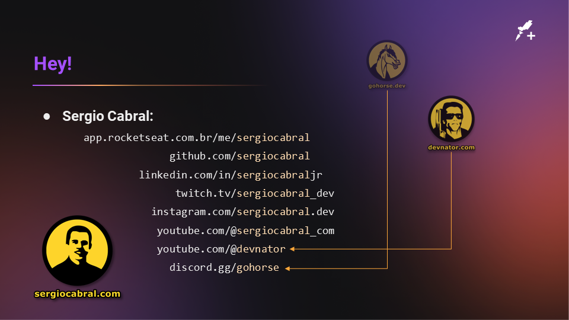

# Interceptando requisições HTTP no JavaScript

Esta aula da coleção Rocketseat+ foi feita com base no [código-fonte](https://github.com/rocketseat-creators-program/app-javascript-elasticsearch-persist-log-2022-02-13) de outra aula (*NodeJS e ElasticSearch: Persistindo mensagens do console.log no banco de dados*)

Esta aula buscou usar um aplicativo pronto que fazia requisições com `XMLHttpRequest` e `fetch`. Desta forma seria possível interceptá-los.

# Execução do app

Para executar o aplicativo deste código-fonte use:

```bash
npm install
npm start
```

Então abra o seu navegador no endereço http://localhost:3000/

# Trecho de código

## XMLHttpRequest

Seque o código de interceptação para o `XMLHttpRequest`.
Basta copiar e colar no Console de um navegador de internet.
Foi testado no Chrome e Edge.

```javascript
const originalXMLHttpRequest = window.XMLHttpRequest;
window.XMLHttpRequest = function() {
    console.log(`XMLHttpRequest created`);
    const instance = new originalXMLHttpRequest(...Array.from(arguments));
    instance.addEventListener("readystatechange", function() {
        console.log(`XMLHttpRequest for url "${this.responseURL}". State changed to: ${this.readyState}`);
    });
    return instance;
}
```

## fetch

Interceptação para a função `fetch`.
Funciona igual ao trecho de código anterior: copiar e colar.

```javascript
const originalFetch = window.fetch;
window.fetch = function() {
    const request = arguments[0]?.constructor === Request ? arguments[0] : undefined;
    const url = request?.url ?? arguments[0];
    console.log(`fetch called for url "${url}".`);
    return new Promise((resolve, reject) => {
        originalFetch
            .apply(this, arguments)
            .then(function() {
                const response = arguments[0];
                console.log(`fetch returned for url "${url}" with status ${response.status} ${response.statusText}.`);
                resolve.apply(this, arguments);
            })
            .catch(function() {
                const error = arguments[0];
                console.log(`fetch fail for url "${url}": ${error}`);
                reject.apply(this, arguments);
            })
            .finally(function() {
                console.log(`fetch finished for url "${url}".`);
            });
    });
}
```
## Slides da aula





## Expert

| [](https://github.com/sergiocabral) |
| :-: |
|[sergiocabral.com](https://sergiocabral.com)|
